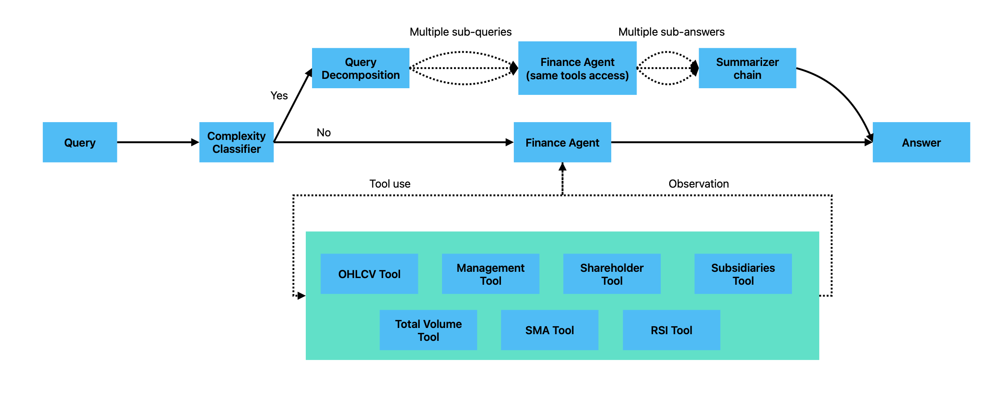

# VnStock Financial Agent - A Financial Agent for the Vietnamese Stock Market by Manh Ha Nguyen

## Folder Structure
```
.
├── app
│   ├── __init__.py
│   ├── agent.py
│   ├── chains.py
│   ├── config.py
│   ├── env.template
│   ├── main.py
│   └── tools.py
├── assets
│   ├── test_results.csv
│   ├── test_template.csv
│   └── workflow_concept.png
├── auto_test.py
├── docker-compose.yml
├── Dockerfile
├── experiment.ipynb
├── LICENSE
├── README.md
└── requirements.txt
```

## Capability

### Query routing
The system automatically classifies queries as **simple** (single tool) or **complex** (multiple tools). Complex queries are decomposed into sub-queries, processed in parallel, and the results are combined into a coherent answer.

### Tools usage
Available tools for Vietnamese stock market analysis:
- `view_ohlcv` - Historical OHLCV data with customizable intervals (1m, 5m, 15m, 30m, 1H, 1D, 1W, 1M)
- `view_management` - Company management/executives information
- `view_shareholders` - Major shareholders information
- `view_subsidiaries` - Subsidiary companies information
- `calculate_total_volume` - Total trading volume calculation
- `calculate_sma` - Simple Moving Average (supports multiple periods)
- `calculate_rsi` - Relative Strength Index

## Usage

### Setup
```bash
# Install dependencies
pip install -r requirements.txt

# Configure environment
cp app/env.template app/.env
# Edit app/.env and add your GOOGLE_API_KEY
```

### For rerunning experiment.ipynb notebook
1. Open `experiment.ipynb` in Jupyter
2. Ensure `app/.env` has your `GOOGLE_API_KEY`
3. Run all cells to test the agent interactively
4. The notebook demonstrates direct agent usage without the FastAPI layer

### For running FastAPI app
1. Run `docker compose up -d` in your terminal.
2. The API will be live at `http://localhost:8000` (or whatever port you set).
3. You can interact with it and see all available endpoints at the documentation page: `http://localhost:8000/docs`

## Architecture overview


## Testing results
1. Testing results can be found under `assets/test_results.csv`
2. Regarding questions 7,8, and 9, a rerun attempt is made manually with the same REST API to account for failed output.
3. This suggests an issue with consistency, not capability, specifically for questions 7, 8, and 9. While the agent can handle these tasks, it doesn't do so reliably on every attempt. Further tuning is required to address this.
